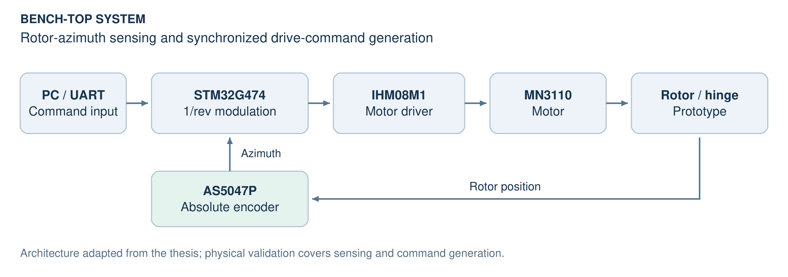
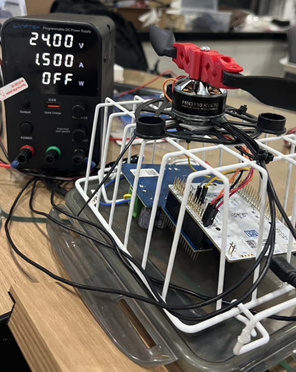
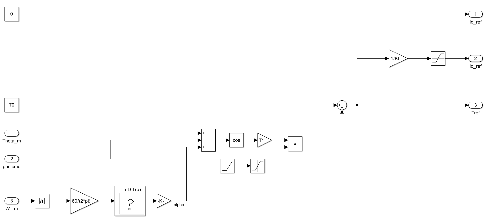
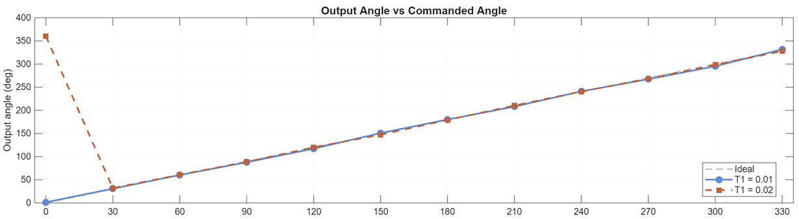
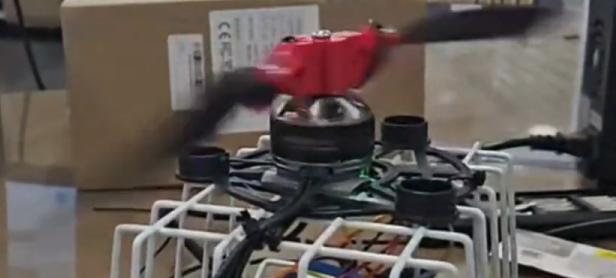
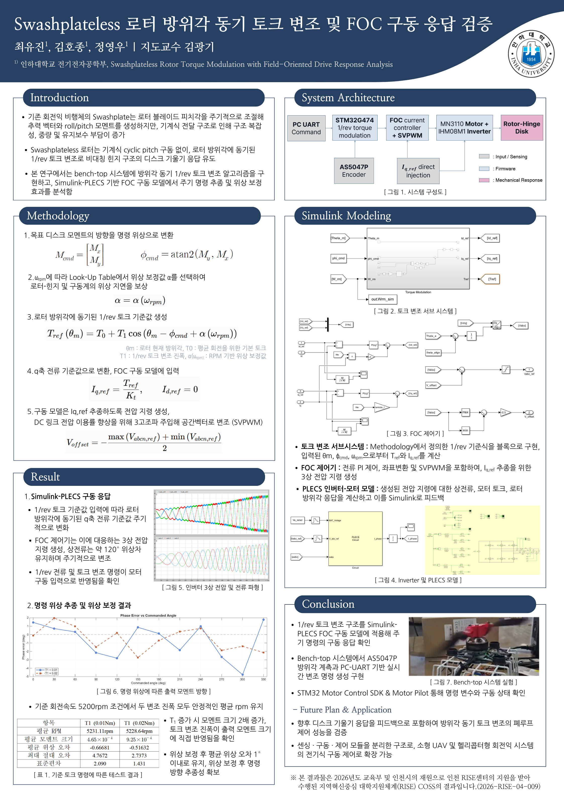

# Swashplateless Rotor

**로터 방위각에 동기된 1/rev 토크 변조 및 구동 응답 분석**

인하대학교 전기전자종합설계 · 2026 
팀장 최유진 · 팀원 정영우, 김호종

  

*논문의 전체 구성도. 구동 제어기와 로터 응답의 정량 분석은 시뮬레이션으로 수행했습니다.*

## 시스템 구성

| 구성 | 장치 |
|---|---|
| 제어 보드 | NUCLEO-G474RE |
| 모터 구동 보드 | X-NUCLEO-IHM08M1 |
| 모터 | T-Motor MN3110 470KV |
| 방위각 센서 | AS5047P 절대 엔코더 |

  

## 임베디드 구현

**방위각 계측 → 영점·각도 경계 보정 → 위상 보정 → 1/rev 명령 갱신**

STM32G4에서 측정 방위각에 맞춰 변조 명령을 생성하고, 0°/360° 경계에서도 위상이 연속되도록 처리했습니다.

## 위상 보정

회전속도별 LUT를 적용해 구동계와 힌지의 위상 지연을 보상했습니다.

  

[모델 설명](docs/howToWork.md) · [Simulink 파일](simulation/)

## 시뮬레이션 결과

**Simulink-PLECS · 변조 진폭 2종 · 명령 위상 0°~330° / 30° 간격**

  

*0° 명령에서 360° 부근의 점은 작은 음의 위상 오차를 나타냅니다.*

| 항목 | 결과 |
|---|---|
| 기준 / 평균 회전속도 | 5200 / 약 5230 rpm |
| 최대 절대 위상 오차 | 4.77° |
| 변조 진폭 2배 입력 | 평균 모멘트 크기 1.99배 |

## Bench-top 검증

  

**PC-UART 명령 입력 → 방위각 계측 → 실시간 변조 명령 생성**을 확인했습니다. 위의 위상 오차와 모멘트 수치는 시뮬레이션 결과입니다.

---

동일 프로젝트로 **제어로봇시스템학회 학부생 논문 경진대회**에 참가했습니다.

학회 발표 포스터

