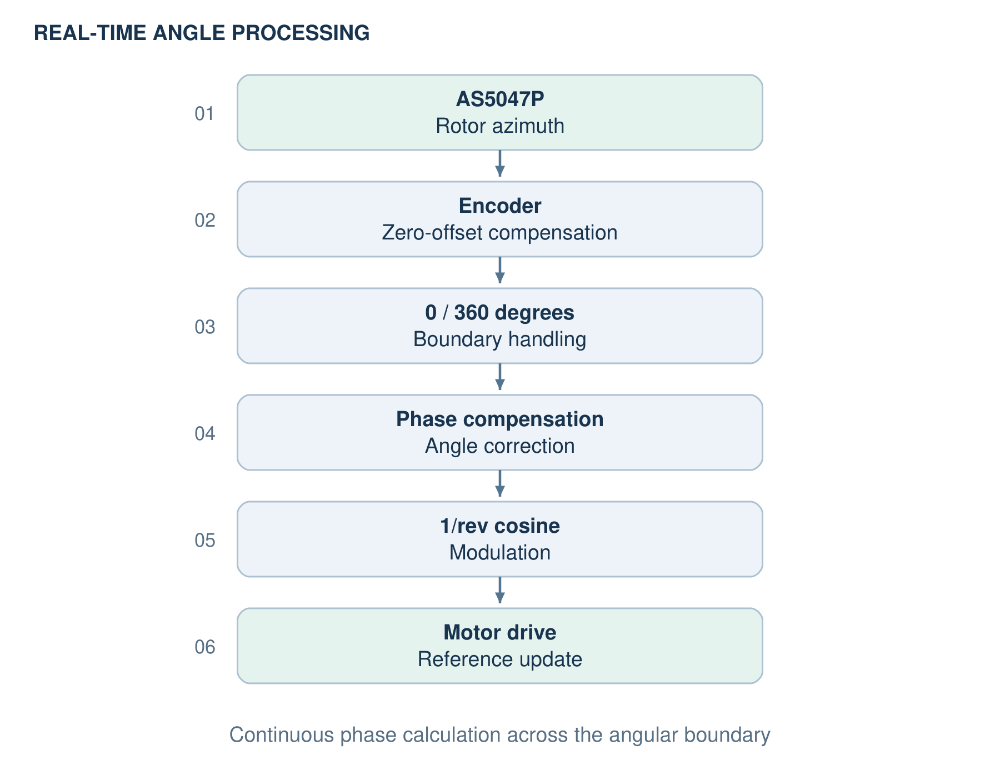

# Swashplateless Rotor

### Azimuth-Synchronized Torque Modulation on STM32G4

A swashplateless rotor project that generates a **1/rev periodic drive command synchronized with rotor azimuth**.

The project combines a real-time STM32G4 bench-top implementation with a Simulink-PLECS drive model for phase-response analysis.

**Inha University · Electrical and Electronic Engineering Capstone Design · 2026**  
**Team Lead: Yu-jin Choi (최유진)** · Team Members: Young-woo Chung (정영우), Ho-jong Kim (김호종)

  

---

## System

The bench-top system measures absolute rotor azimuth and updates the synchronized modulation command in real time.

| Component | Device |
|---|---|
| MCU | STM32G474RE NUCLEO |
| Motor Driver | X-NUCLEO-IHM08M1 |
| Motor | T-Motor MN3110 470KV |
| Rotor Position Sensor | AS5047P Magnetic Absolute Encoder |

  

---

## Embedded Implementation

The STM32 firmware processes the rotor-angle measurement and generates the 1/rev modulation command in the following sequence.

  

The encoder installation offset is compensated in firmware, and the angular boundary is handled so that the modulation phase remains continuous when the rotor passes between 359° and 0°.

Using the corrected rotor azimuth, the drive reference is updated in real time on the STM32G4.

---

## Phase Compensation

A Simulink-PLECS model was constructed using the MN3110 motor parameters to analyze the response of the azimuth-synchronized periodic command.

Because the mechanical response delay changes with rotor speed, the phase-compensation angle was implemented as a speed-dependent Look-Up Table (LUT).

  

*Torque-modulation subsystem from the simulation model.*

[Simulink model and supporting files](simulation/) · [Model](simulation/SwashPlateless_ESC.slx) · [Parameters](simulation/Swash.m) · [Sweep script](simulation/Sweep_param.m) · [Phase-sign check](simulation/Check_alpha_sign.m) · [Recorded sweep results](simulation/Swash_Sweep_Results.xlsx)

*Archived project files for reference; a complete reproduction environment is not bundled.*

---

## Results

**Simulink-PLECS simulation results** — two modulation amplitudes, with 12 commanded phases per amplitude (0° to 330° in 30° steps).

  

*Angles are displayed modulo 360°: the point near 360° at a 0° command represents a small negative phase error.*

| Metric | Result |
|---|---|
| Reference rotor speed | 5200 rpm |
| Mean rotor speed | ≈ 5230 rpm |
| Maximum absolute phase error | 4.77° |
| Modulation amplitude | 2× (0.01 → 0.02 N·m) |
| Mean output-moment magnitude | 1.99× |

In simulation, the output-moment direction followed the commanded phase over the tested full-azimuth sweep.

The maximum absolute phase error was approximately 4.77°, and doubling the modulation amplitude increased the mean output-moment magnitude by approximately 1.99×.

---

## Bench-top Validation

  

The STM32G4 controller, motor driver, MN3110 motor, and AS5047P encoder were integrated into a physical bench-top system.

During motor rotation, the following embedded processing path was verified:

**PC-UART command → rotor-azimuth measurement → real-time 1/rev modulation-command generation**

The bench test focused on rotor-angle sensing and synchronized command generation, while quantitative phase-response performance was evaluated separately using the Simulink-PLECS model.

---

## My Role

**Yu-jin Choi (최유진) · Team Lead**

- Hardware configuration and bench-top system integration
- STM32G4 firmware implementation
- AS5047P rotor-azimuth sensing and angle processing
- Real-time 1/rev modulation-command generation
- Simulink-PLECS drive-response analysis
- Speed-dependent phase-compensation LUT design and validation

## Project

**Drive Response Analysis of Azimuth-Synchronized Torque Modulation for a Swashplateless Rotor**

인하대학교 전기전자종합설계 프로젝트 · 2026  
Inha University · Department of Electrical and Electronic Engineering

| Role | Name |
|---|---|
| Team Lead | 최유진 · Yu-jin Choi |
| Team Member | 정영우 · Young-woo Chung |
| Team Member | 김호종 · Ho-jong Kim |
| Faculty Advisor | 김광기 교수 · Prof. Kwang-ki Kim |

The same project was presented in the **Institute of Control, Robotics and Systems (ICROS) undergraduate paper competition** in 2026.  
동일 프로젝트로 **제어로봇시스템학회 학부생 논문 경진대회**에 참가했습니다.

Conference poster · 학회 발표 포스터

The original poster is included as presentation material. The validation scope and simulation results are distinguished in the sections above.

Figure sources & acknowledgments

The figures and reported simulation metrics are based on the team's 2026 Inha University capstone thesis and conference materials.

- **System overview:** simplified adaptation of the thesis system architecture and bench-top description, showing the physical sensing and drive-command path.
- **Bench setup:** device-photo crop from thesis Figure 7, extracted from the original HWP image.
- **Embedded flow:** redrawn from the thesis firmware-processing description and checked against the supplied STM32 source.
- **Simulation model:** original torque-modulation subsystem from thesis Figure 3(c).
- **Phase tracking:** original commanded-angle/output-direction plot from thesis Figure 10.
- **Bench validation:** original test photograph from thesis Figure 11.
- **Conference poster:** original team presentation artwork.

본 과제(결과물)는 2026년도 교육부 및 인천시의 재원으로 인천RISE센터의 지원을 받아 수행된 지역혁신중심 대학지원체계(RISE) COSS의 결과입니다. (2026-RISE-04-009)

