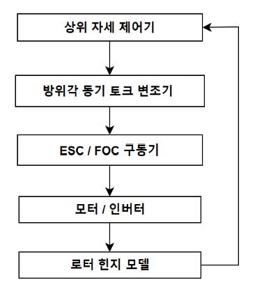
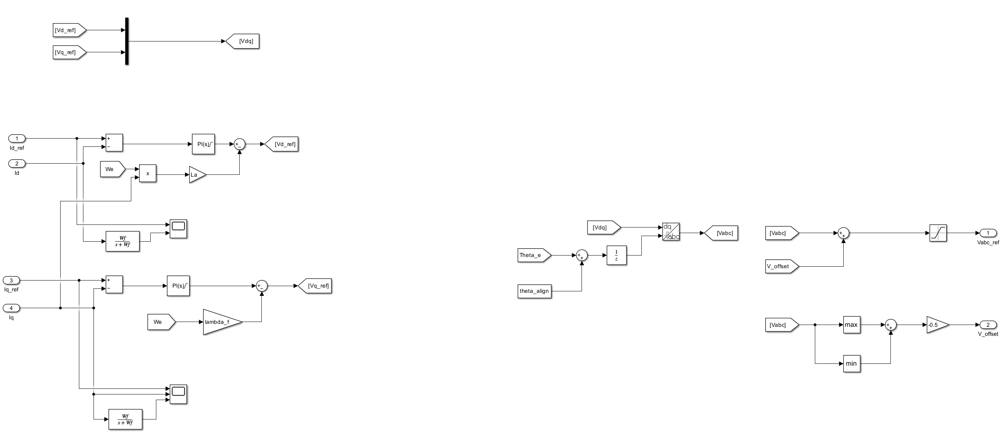
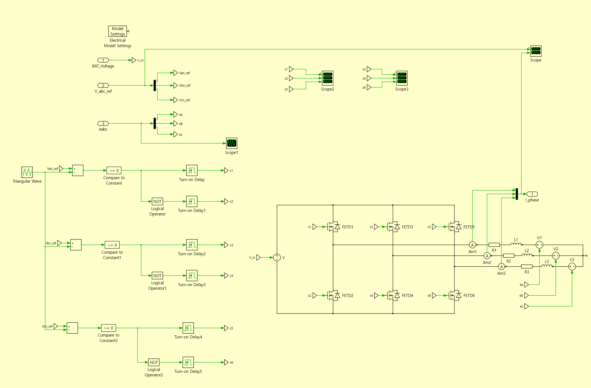
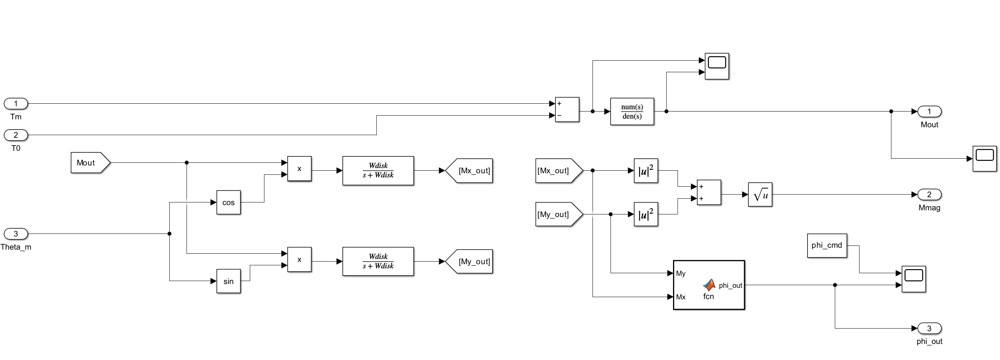
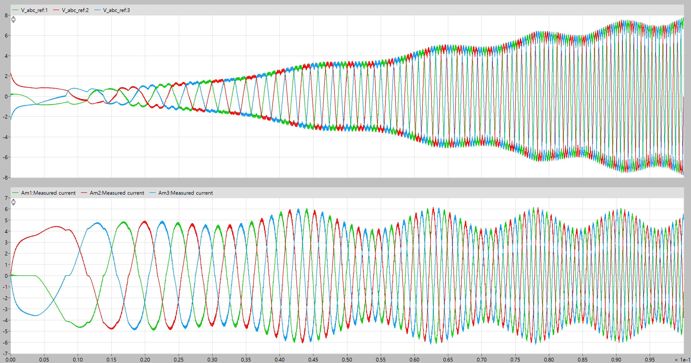
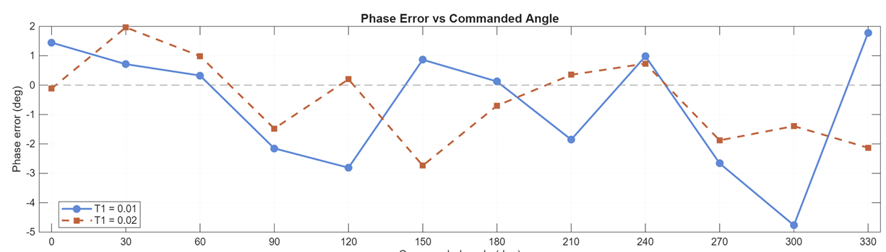
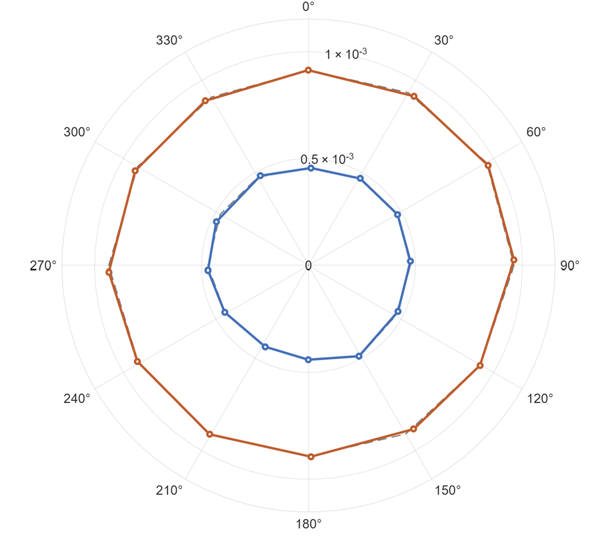

# Swashplateless 로터 Simulink 모델 이론 설명

[← 프로젝트 소개](../README.md) · [Simulink 모델](../simulation/SwashPlateless_ESC.slx) · [모델 파라미터](../simulation/Swash.m)

## 1. 개요

이 문서는 로터 방위각에 동기된 **1/rev 토크 변조**를 생성하고, 모터 구동 응답과 출력 모멘트 방향을 분석하는 Simulink-PLECS 모델을 설명합니다. 졸업논문의 수식을 기준으로 각 식이 실제 모델의 어느 블록에 대응하는지 정리했습니다.

기계식 swashplate로 블레이드 피치를 직접 조작하는 대신, 로터 한 바퀴 동안 토크를 주기적으로 변화시켜 힌지 응답을 유도하는 개념입니다. 시뮬레이션에서는 토크 명령의 위상과 크기에 따른 응답을 분석합니다. 실제 Bench-top에서 확인한 범위는 방위각 계측과 실시간 변조 명령 생성입니다.

## 2. 전체 구조

  

1. 목표 모멘트의 방향을 명령 위상으로 표현합니다.
2. 현재 방위각과 회전속도로 1/rev 토크 기준값을 계산합니다.
3. 토크 기준값을 전류 기준값으로 변환합니다.
4. 전류 제어기와 PLECS 인버터 회로가 상전류 응답을 계산합니다.
5. 모터 회전과 힌지 응답으로 출력 모멘트의 크기·방향을 계산합니다.
6. 계산된 방위각과 회전속도를 변조기에 다시 전달합니다.

위 그림은 논문의 전체 제어 개념입니다. 공개한 모델에서는 상위 자세 제어기를 연결하는 대신 `T1`과 `phi_cmd`를 직접 설정하여 구동 응답을 분석합니다. 출력 모멘트 오차를 상위 자세 제어기로 되돌리는 폐루프 자세 제어는 이 분석에 포함하지 않습니다.

| 모델 블록 | 역할 | 주요 신호 |
|---|---|---|
| `Torque Modulation` | 방위각 동기 기준파 및 전류 명령 생성 | `Theta_m`, `phi_cmd`, `W_rm` → `Tref`, `Iq_ref` |
| `FOC Controller` | 전류 오차를 전압 지령으로 변환 | `Id_ref`, `Iq_ref`, `Id`, `Iq` → `Vabc_ref` |
| `Circuit` | PLECS 인버터·상회로 계산 | 전압 지령, 역기전력 → 상전류 |
| `Motor` | 회전 운동, 전류 좌표변환, 역기전력 계산 | `Tm`, 상전류 → `Theta_m`, `W_rm`, `eabc` |
| `Moment` | 힌지 응답 및 모멘트 방향 계산 | `Tm`, `T0`, `Theta_m` → `Mmag`, `phi_out` |

### 2.1 주요 변수

| 기호 | 의미 | 단위 / 모델 변수 |
|---|---|---|
| $\theta_m$ | 로터 기계 방위각 | rad · `Theta_m` |
| $\omega_m$ | 로터 기계 각속도 | rad/s · `W_rm` |
| $n$ | 회전속도의 크기 | rpm |
| $\phi_{cmd}$ | 목표 모멘트 방향에 대응하는 명령 위상 | rad · `phi_cmd` |
| $T_0$ | 평균 회전을 형성하는 기본 토크 | N·m · `T0` |
| $T_1$ | 1/rev 토크 변조 진폭 | N·m · `T1` |
| $\alpha$ | 회전속도에 따른 위상 보정값 | rad |
| $K_t$ | 등가 토크 상수 | N·m/A · `Kt` |
| $p$ | 모터 극쌍수 | `p = 7` |
| $M_x,M_y$ | 모델에서 계산한 디스크 평면 모멘트 성분 | N·m |

모델 내부 각도는 rad 단위이며, 결과 그래프와 LUT 설명에는 deg 단위도 사용합니다. 특히 로터의 **기계 방위각**과 전류 좌표변환에 사용하는 **전기각**을 구분해야 합니다.

## 3. 방위각 동기 토크 변조

### 3.1 모멘트 방향과 명령 위상

논문에서는 디스크 평면의 목표 모멘트를 다음과 같이 표현합니다.

$$
\mathbf{M}_{cmd}=\begin{bmatrix}M_x\\M_y\end{bmatrix},\qquad
A=\sqrt{M_x^2+M_y^2},\qquad
\phi_{cmd}=\operatorname{atan2}(M_y,M_x)
$$

$A$는 목표 모멘트의 크기, $\phi_{cmd}$는 방향입니다. 공개 모델의 스윕은 목표 모멘트 크기를 토크 진폭으로 변환하는 상위 제어기를 사용하지 않고, $T_1$과 $\phi_{cmd}$를 독립적으로 지정합니다. 따라서 $A$와 $T_1$을 동일한 값으로 가정하지 않습니다.

### 3.2 1/rev 기준파

  

정상적인 변조 구간의 토크 기준값은 다음과 같습니다.

$$
T_{ref}(\theta_m)=T_0+T_1\cos\bigl(\theta_m-\phi_{cmd}+\alpha(n)\bigr)
$$

로터 방위각이 $2\pi$만큼 증가할 때 cosine도 한 주기를 진행하므로 **한 회전당 한 번의 변조(1/rev)**가 만들어집니다. $T_1$은 토크 변화의 크기를, $\phi_{cmd}$는 토크가 증가하는 방위각을 조절합니다.

실제 블록에는 변조를 점진적으로 인가하기 위한 `Ramp → Saturation2` 경로도 있습니다.

$$
\begin{aligned}
r(t)&=\operatorname{clip}\bigl(50(t-0.02),0,1\bigr),\\
T_{ref}(t)&=T_0+r(t)T_1\cos\bigl(\theta_m(t)-\phi_{cmd}+\alpha(n)\bigr)
\end{aligned}
$$

공개 모델의 설정에서는 0.02초부터 변조 진폭이 증가하고 0.04초 이후에는 설정한 진폭 전체가 적용됩니다.

### 3.3 회전속도 기반 위상 보정

구동계와 힌지 응답의 지연 때문에 명령 위상과 출력 모멘트 방향이 달라질 수 있습니다. 이를 보상하기 위해 현재 회전속도에 대응하는 위상 보정값을 LUT에서 읽습니다.

$$
n=\frac{60}{2\pi}|\omega_m|,\qquad
\alpha(n)=s_\alpha\,\operatorname{LUT}(n)
$$

| 회전속도 $n$ (rpm) | 0 | 1000 | 2000 | 3000 | 4000 | 5000 | 6000 |
|---|---|---|---|---|---|---|---|
| 위상 보정값 (deg) | 0 | 20 | 45 | 70 | 90 | 108 | 108 |

[Swash.m](../simulation/Swash.m)에서 `rpm_bp`, `alpha_bp_rad`를 정의하고, `alpha_sign`으로 $s_\alpha$를 설정합니다. 기본값은 `+1`이며, [Check_alpha_sign.m](../simulation/Check_alpha_sign.m)은 보상 없음, 양의 보상, 음의 보상을 비교합니다.

LUT 구간 사이를 선형 보간하는 의미는 다음과 같습니다.

$$
\alpha(n)=s_\alpha\left[\alpha_i+
\frac{n-n_i}{n_{i+1}-n_i}(\alpha_{i+1}-\alpha_i)\right],
\qquad n_i\le n\le n_{i+1}
$$

LUT는 이 프로젝트의 모델 조건에서 사용한 보정값입니다. 회전속도별 보정 테이블을 사용한다는 것과 모든 속도에서 동일한 오차 성능을 검증했다는 것은 구분해야 합니다. 뒤의 정량 결과는 논문에 제시한 약 5200 rpm 조건의 위상 스윕입니다.

## 4. 전류 기준값과 제어기

### 4.1 토크를 q축 전류로 변환

등가 모터 모델에서는 토크와 q축 전류를 다음 관계로 연결합니다.

$$
T_m=K_t i_q,\qquad
i_{q,ref}=\operatorname{clip}\left(\frac{T_{ref}}{K_t},-I_{max},I_{max}\right),\qquad
i_{d,ref}=0
$$

`Torque Modulation`의 `Gain2 = 1/Kt`와 `Saturation = ±Imax`가 전류 기준값을 생성합니다. 최상위 모델의 `Gain4 = Kt`는 피드백 q축 전류로부터 모터 토크 `Tm`을 계산합니다.

MN3110 KV470의 등가 파라미터는 다음 식으로 설정되어 있습니다.

$$
K_t=\frac{60}{2\pi\cdot470}\approx0.02032\ \mathrm{N\!\cdot m/A},\qquad
\lambda_f=\frac{K_t}{1.5p}
$$

여기서 $\lambda_f$는 역기전력 계산에 사용하는 등가 자속 상수입니다. 이 값들은 공개 파라미터 파일의 모델링 값입니다.

### 4.2 d-q 전류 PI 제어

  

FOC 전류 제어는 회전 좌표계의 d축·q축 전류 오차로 전압 지령을 생성하는 구조입니다. [MathWorks의 FOC 설명](https://www.mathworks.com/help/mcb/gs/implement-motor-speed-control-by-using-field-oriented-control-foc.html)에서도 이 전류 PI 제어 구조를 설명합니다.

$$
e_d=i_{d,ref}-i_d,\qquad e_q=i_{q,ref}-i_q
$$

포화가 없는 구간에서 각 축의 PI 출력은 다음과 같습니다.

$$
u_d=K_{pc}e_d+K_{ic}\int e_d\,dt,\qquad
u_q=K_{pc}e_q+K_{ic}\int e_q\,dt
$$

[Swash.m](../simulation/Swash.m)에서는 전류 제어 대역폭 $f_{c,i}=300\ \mathrm{Hz}$를 기준으로 이득을 설정합니다.

$$
\omega_{cc}=2\pi f_{c,i},\qquad
K_{pc}=L_a\omega_{cc},\qquad
K_{ic}=R_a\omega_{cc},\qquad
K_{ac}=\frac{K_{ic}}{K_{pc}}
$$

PI 출력에는 $\pm V_{dc}/\sqrt{3}$ 제한과 `back-calculation` 방식의 anti-windup이 설정되어 있습니다. 블록 이름은 `Discrete PID Controller`이지만 저장된 내부 설정은 `PI`, `Parallel`, `Continuous-time`입니다.

공개 SLX의 합산 부호와 연결을 그대로 쓰면 보상항을 포함한 전압 지령은 다음과 같습니다.

$$
v_{d,ref}=u_d-\omega_e L_a i_q,\qquad
v_{q,ref}=u_q-\omega_e\lambda_f,\qquad
\omega_e=p\omega_m
$$

첫 번째 식은 `Product3 → Gain10 → Sum5`, 두 번째 식은 `Gain12 → Sum6`에 대응합니다. 위 식은 이 저장본의 연결을 기술한 것입니다. 좌표축·역기전력 부호가 다른 모터 모델에 보상항의 부호를 그대로 적용할 수는 없습니다.

## 5. 3상 전압 지령과 인버터

### 5.1 회전 좌표계에서 3상으로 변환

전류 제어기의 두 전압 지령은 `RRF->3ph` 블록에서 3상 전압으로 변환됩니다. 변환에는 전기각과 정렬 보정값이 사용됩니다.

$$
\vartheta=p\theta_m+\theta_{align},\qquad
\theta_{align}=-3^\circ
$$

각 상의 기준 각도를 $\vartheta_a=\vartheta$, $\vartheta_b=\vartheta-2\pi/3$, $\vartheta_c=\vartheta+2\pi/3$으로 두면 변환식은 다음과 같습니다.

$$
v_{k,n}=v_{d,ref}\cos\vartheta_k-v_{q,ref}\sin\vartheta_k,
\qquad k\in\{a,b,c\}
$$

이는 [PLECS의 RRF→3ph 변환 정의](https://docs.plexim.com/plecs/latest/components-by-category/dq2abc/)에 따른 식입니다. 실제 모델에서는 변환각 경로에 `Unit Delay` 블록도 포함됩니다.

### 5.2 공통 모드 전압 주입

논문의 SVPWM 설명에 대응하는 모델 구현은 세 전압 지령의 최댓값·최솟값으로 공통 모드 오프셋을 계산하는 방식입니다.

$$
v_{offset}=-\frac{\max(v_{a,n},v_{b,n},v_{c,n})+\min(v_{a,n},v_{b,n},v_{c,n})}{2}
$$

$$
v_{k,ref}=\operatorname{clip}\bigl(v_{k,n}+v_{offset},-0.49V_{dc},0.49V_{dc}\bigr)
$$

`MinMax`, `MinMax1`, `Gain3 = -0.5`, `Sum3`, `Saturation1`이 이 연산을 수행합니다. 같은 오프셋을 세 상에 더하므로 포화가 없는 구간에서는 선간전압 차이가 유지됩니다.

### 5.3 PLECS 상회로

  

`Circuit`은 DC 전원, 인버터 스위칭 회로, 모터의 등가 상회로를 구성합니다. 전압 지령과 역기전력을 받아 상전류를 계산하고, 상전류는 Simulink의 전류 좌표변환 경로로 돌아갑니다. 모터의 기계 회전과 힌지 응답은 아래 Simulink 블록에서 계산됩니다.

## 6. 모터 회전과 역기전력

`Motor` 서브시스템은 토크에서 점성 마찰과 회전 부하를 빼고 각속도·방위각을 적분합니다.

$$
J\dot{\omega}_m=T_m-B\omega_m-K_Q\omega_m|\omega_m|,\qquad
\dot{\theta}_m=\omega_m
$$

| 항 | 모델에서의 의미 |
|---|---|
| $J\dot{\omega}_m$ | 관성에 의한 가속 토크 |
| $B\omega_m$ | 점성 마찰 토크 |
| $K_Q\omega_m|\omega_m|$ | 회전 방향을 반영한 속도 제곱 부하 근사 |

`Gain7 = 1/J`와 두 개의 `Integrator`가 순서대로 $\omega_m$, $\theta_m$을 계산합니다. `Abs → Product2 → Gain6`는 부하 토크를 계산합니다.

$$
K_Q=\frac{T_0}{\omega_0^2},\qquad
\omega_0=5000\frac{2\pi}{60}\ \mathrm{rad/s}
$$

여기의 5000 rpm은 공개 `Swash.m`에서 부하 계수를 정하기 위한 기준입니다. README에 정리한 논문의 5200 rpm 시험 조건과는 구분합니다.

`MATLAB Function1`은 정현파 역기전력을 계산합니다.

$$
\begin{aligned}
e_a&=\omega_e\lambda_f\sin\vartheta,\\
e_b&=\omega_e\lambda_f\sin(\vartheta-2\pi/3),\\
e_c&=\omega_e\lambda_f\sin(\vartheta+2\pi/3)
\end{aligned}
$$

이 신호가 PLECS 회로로 전달되고, 계산된 상전류는 `3ph->RRF`를 거쳐 전류 제어기와 토크 계산에 사용됩니다.

## 7. 힌지 응답과 출력 모멘트

### 7.1 1차 지연 근사

  

힌지와 블레이드의 복잡한 기계 응답은 1차 지연 전달함수로 단순화합니다.

$$
G_h(s)=\frac{K_h}{\tau_hs+1},\qquad
\Delta T=T_m-T_0,\qquad
M_h(s)=G_h(s)\Delta T(s)
$$

공개 모델의 `Moment/Subtract3`는 **모터 토크 $T_m$에서 기본 토크 $T_0$를 뺀 값**을 입력으로 사용합니다. `Transfer Fcn1`의 분자는 `Kh`, 분모는 `[tau_h 1]`입니다. 여기서 $M_h$는 블록의 스칼라 출력 `Mout`을 설명하기 위한 기호입니다.

이 식은 응답 분석을 위한 등가 모델이며, 실제 STEP 형상의 접촉·탄성·공력 해석을 수행하는 모델은 아닙니다.

### 7.2 디스크 평면의 모멘트 성분

힌지 응답을 방위각의 cosine·sine으로 투영한 뒤 저역통과 필터를 적용합니다.

$$
H_d(s)=\frac{\omega_{disk}}{s+\omega_{disk}},\qquad
\omega_{disk}=2\pi\cdot20
$$

$$
M_x=H_d\{M_h\cos\theta_m\},\qquad
M_y=H_d\{M_h\sin\theta_m\}
$$

$H_d\{\cdot\}$는 중괄호 안의 시간 신호를 해당 필터에 통과시킨다는 뜻입니다. 모델에서는 `Product`, `Product1` 및 `Transfer Fcn2`, `Transfer Fcn3`가 대응합니다.

### 7.3 크기와 방향

$$
M_{mag}=\sqrt{M_x^2+M_y^2},\qquad
\phi_{out}=\operatorname{atan2}(M_y,M_x)
$$

제곱·합·제곱근 블록이 `Mmag`를 계산하고, `MATLAB Function`이 `phi_out`을 계산합니다. 따라서 출력 방향은 토크 파형의 순간값 자체가 아니라, 방위각 투영과 필터를 거쳐 얻은 평면 모멘트 성분으로 정의됩니다.

## 8. 시뮬레이션 결과 해석

### 8.1 전압과 전류 응답

  

상단은 3상 전압 지령, 하단은 상전류입니다. 회전 중 방위각에 동기된 토크 기준이 전류 지령에 반영되면서 상전류 진폭이 주기적으로 변합니다. 이 그림은 Simulink-PLECS 결과이며 실제 장치에서 취득한 전류 측정 결과가 아닙니다.

### 8.2 위상 오차 계산

[Sweep_param.m](../simulation/Sweep_param.m)은 $T_1=0.01,\ 0.02\ \mathrm{N\!\cdot m}$와 $\phi_{cmd}=0^\circ,30^\circ,\ldots,330^\circ$를 조합한 24개 경우를 평가합니다. 저장된 시계열의 마지막 10%에 해당하는 샘플을 사용해 속도·모멘트 크기를 평균하고, 방향은 원형 평균으로 계산합니다.

$$
\bar{\phi}_{out}=\arg\left(\frac{1}{N}\sum_{k=1}^{N}e^{j\phi_{out,k}}\right)
$$

$$
e_\phi=\operatorname{mod}\bigl(\bar{\phi}_{out,deg}-\phi_{cmd,deg}+180,360\bigr)-180
$$

예를 들어 359°와 1°의 방향은 0° 부근입니다. 원형 평균과 위 식을 사용하면 0°/360° 표기 경계가 큰 위상 오차로 계산되는 것을 피할 수 있습니다.

  

0° 명령에서 360°에 가까운 점은 작은 음의 오차를 0°~360° 범위로 표시한 결과입니다.

  

### 8.3 논문의 정량 결과

아래 값은 졸업논문 표 3의 시뮬레이션 결과입니다.

| 항목 | $T_1=0.01$ N·m | $T_1=0.02$ N·m |
|---|---:|---:|
| 평균 회전속도 (rpm) | 5231.11 | 5228.64 |
| 평균 모멘트 크기 (N·m) | $4.65\times10^{-4}$ | $9.25\times10^{-4}$ |
| 평균 위상 오차 (deg) | −0.66681 | −0.51632 |
| 최대 절대 위상 오차 (deg) | 4.7672 | 2.7373 |
| 위상 오차 표준편차 (deg) | 2.090 | 1.431 |

  

변조 진폭을 2배로 증가시켰을 때 평균 모멘트 크기의 비율은 다음과 같습니다.

$$
\frac{9.25\times10^{-4}}{4.65\times10^{-4}}\approx1.99
$$

이는 해당 시뮬레이션 조건에서 입력 진폭에 대해 출력 모멘트 크기가 거의 비례함을 보여줍니다. 실제 로터 기울기나 비행 자세 제어를 검증한 수치로 해석하지 않습니다.

## 9. 모델 파일과 기준 자료

| 파일 | 내용 |
|---|---|
| [SwashPlateless_ESC.slx](../simulation/SwashPlateless_ESC.slx) | Simulink-PLECS 모델 본체 |
| [Swash.m](../simulation/Swash.m) | 모터·부하·전류 제어·힌지·위상 LUT 파라미터 |
| [Sweep_param.m](../simulation/Sweep_param.m) | 변조 진폭과 명령 위상에 따른 응답 평가 |
| [Check_alpha_sign.m](../simulation/Check_alpha_sign.m) | 위상 보상 적용 여부와 부호 비교 |
| [Swash_Sweep_Results.xlsx](../simulation/Swash_Sweep_Results.xlsx) | 기존에 저장한 스윕 결과 |

수식과 그림의 기준은 팀의 졸업논문 「Swashplateless 로터 방위각 동기 토크 변조 및 구동 응답 분석」입니다. 블록 이름·연결·수치 설정은 공개한 SLX와 MATLAB 파일을 대조했습니다. 논문의 요약 표현과 저장본의 상세 구현이 다른 경우에는 본문에서 구분했습니다. 모델을 새로 실행하여 결과를 재산출한 문서는 아닙니다.

[← 프로젝트 소개로 돌아가기](../README.md)
